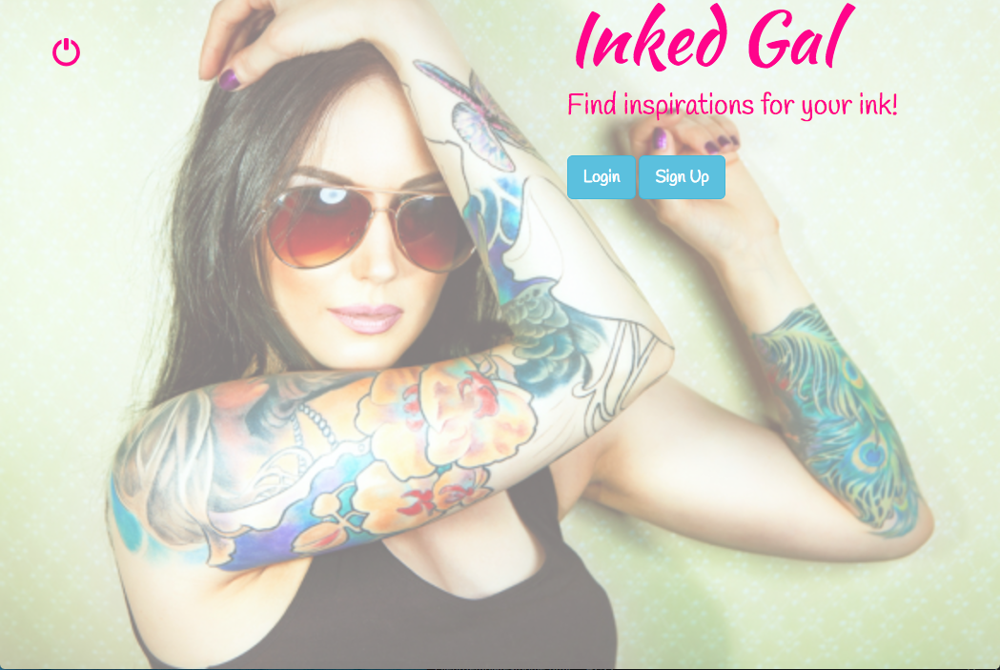

#InkedGal
---
 
###About:

All ink enthusiast know that the only thing better than ink is fresh ink.  We're constantly looking for new inspiration for our body art.  **InkedGal** provides a way for ink lovers to storyboard their tattoo ideas.     

When Googling tattoo images or finding inspiration on Pinterest, there's no direct connect to the tattoo artist.  **InkedGal**  is designed so that users have a link to tattoo artists through Instagram even if they don't have an Instagram account.  By simply clicking on the image, a user can post that image to their INKspiration page.

 
[Visit site here](https://inkedgal.herokuapp.com/)

Dash board of the site:

---

###Acknowledgement

Philippe Luchansky

Jimmy Garzon

John Meredith

Roland Abregorivas

Troy Carson

---

###Content
* Data Modeling
* Technologies Used
* User Stories
* Future implementations
* Acknowledgement
     

---
  
###Technologies Used
>* Languages: Javascript, HTML5/CSS
>* Web-Application Frameworks: Node.js [Express |
>* Front-end Libraries: Angular, Bootstrap
>* Database: MongoDB
>* Object Relational/Document Mappers: Mongoose
>* CSS pre-compilers: SaSS
>* Version Control: Git/ Github
>* Deployment: Heroku

  

---

### Data Modeling

---

###User Stories

User POV:

1. As a user, I can create a profile by providing my name, email address and my favorite tattoo artists' Instagram handle.

2. As a user, I can build an inspiration board by bookmarking images I like to my INKspiration page.

---

###Future implementations

1. As a user, I want to upload photos.

2. As a user, I want to comment on other users photos.

3. As a user, I want to like other users' and artists' photos.

4. As a user, I want to have a link to other users' INKspirations.

5. As a user, I want a mapping feature so I can easily locate tattoo studios.

6. As a user, I want a search feature to find inks and tattoo artist.

7. As a user, I want to delete images from my INKspiration board.

###Acknowledgements:
Credits: 

* npm packages:

npm Packages| Author/Authors
--------------|------
express | ganey
